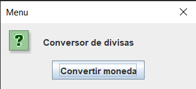

# CONVERSOR DE DIVISAS

Conversor de divisas es un proyecto desarrollado en Java que permite realizar conversiones de peso colombiano a otras monedas y viceversa.

-Puedes convertir peso colombiano a dolar,euro, yen, libra y won coreano.
-También puedes convertir cualquiera de esas monedas a peso colombiano,

#Capturas de pantalla

Te muestro algunas capturas del funconamiento del Conversor:

## Cómo usar

Para utilizar este proyecto, sigue estos pasos:

1. Clona el repositorio.
2. Ejecuta el comando `npm install`.
3. Inicia la aplicación con `npm start`.

## Contribuir

Si deseas contribuir a este proyecto, por favor sigue estos pasos:

1. Haz un fork del repositorio.
2. Crea una nueva rama (`git checkout -b nueva-caracteristica`).
3. Realiza tus cambios y haz commit (`git commit -m 'Añadida nueva característica'`).
4. Sube tus cambios (`git push origin nueva-caracteristica`).
5. Crea una solicitud de extracción.
