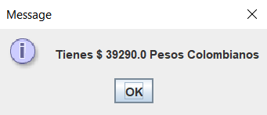

# CONVERSOR DE DIVISAS

Conversor de divisas es un proyecto desarrollado en Java que permite realizar conversiones de peso colombiano a otras monedas y viceversa.

-Puedes convertir peso colombiano a dolar,euro, yen, libra y won coreano.
-También puedes convertir cualquiera de esas monedas a peso colombiano,

## Capturas de pantalla

Te muestro algunas capturas del funconamiento del Conversor:

En el siguiente módulo, se ingresa el valor a convertir.
!(img/img2.png)

Luego, se elige la conversión que quieras.

Se muestra el resultado de la conversión.

Módulo para escoger si quieres realizar otra conversión o no.

Fin del programa.

## Cómo usar

Para utilizar este proyecto, sigue estos pasos:

1. Clona el repositorio del proyecto o descargarlo por medio de un .zip.
2. Importa el repositorio a tu IDE.
3. Ejecuta el programa.

## Contribuir

Si deseas contribuir a este proyecto, por favor sigue estos pasos:

1. Haz un fork del repositorio.
2. Crea una nueva rama (`git checkout -b nueva-caracteristica`).
3. Realiza tus cambios y haz commit (`git commit -m 'Añadida nueva característica'`).
4. Sube tus cambios (`git push origin nueva-caracteristica`).
5. Crea una solicitud de extracción.
